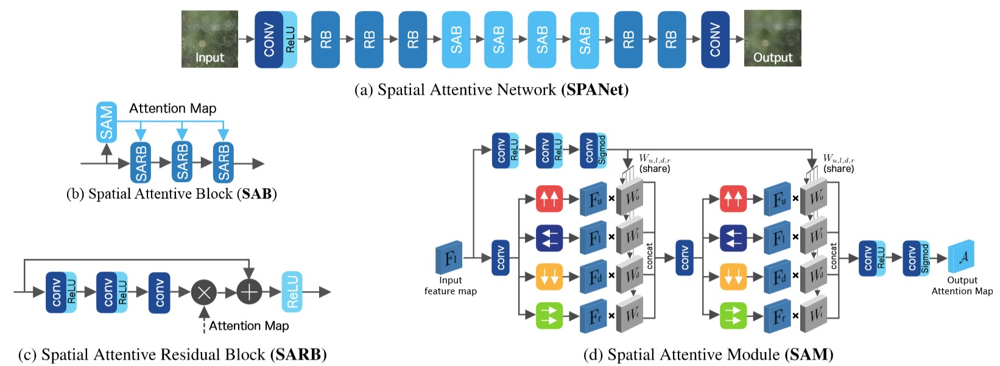
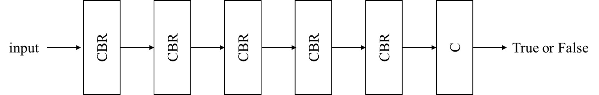
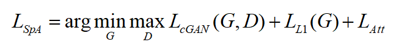
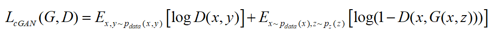
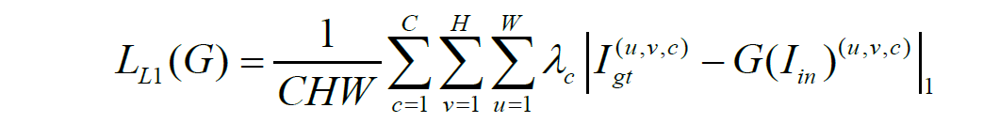
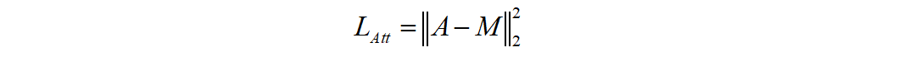

<div align="center">
<h1>SpA GAN for Cloud Removal</h1>
</div>

<div align="center">
    
</div>
<div align="center">
  
</div>

This codes is mainly copy from https://github.com/Penn000/SpA-GAN_for_cloud_removal


## 1. INTRODUCTION

This is the source code of [***Cloud Removal for Remote Sensing Imagery via Spatial Attention Generative Adversarial Network***](https://arxiv.org/abs/2009.13015). In this work, I proposes a novel cloud removal model called ***spatial attention generative adversarial networks*** or ***SpA GAN***, which use [spatial attention networks (SPANet)](https://github.com/stevewongv/SPANet) as generator. The architecture of *SpA GAN* is shown as fellow:

- **Generator**

*SpA GAN* uses *spatial attention networks* an generator. See `./models/gen/SPANet.py` for more details.

<div align="center"></div>

- **Discriminator**

Discriminator is a fully  CNN that **C** is convolution layer, **B** is batch normalization and **R** is Leaky ReLU. See `./models/dis/dis.py` for more details.

<div align="center"></div>

- **Loss**

The total loss of *SpA GAN* is formulated as fellow:

<div align="center"></div>

the first part is the loss of GAN

<div align="center"></div>

the second part is standard $L_1$ loss where $\lambda_c$ is a hyper parameter to control the weight of each channel to the loss.

<div align="center"></div>

the third part is attention loss where $A$ is the attention map and $M$ is the mask of cloud that computed from $M=|I_{in}-I_{gt}|_1$.

<div align="center"></div>


### Citations

```
@article{Pan2020,
  title   = {Cloud Removal for Remote Sensing Imagery via Spatial Attention Generative Adversarial Network},
  author  = {Heng Pan},
  journal = {arXiv preprint arXiv:2009.13015},
  year    = {2020}
}
```


